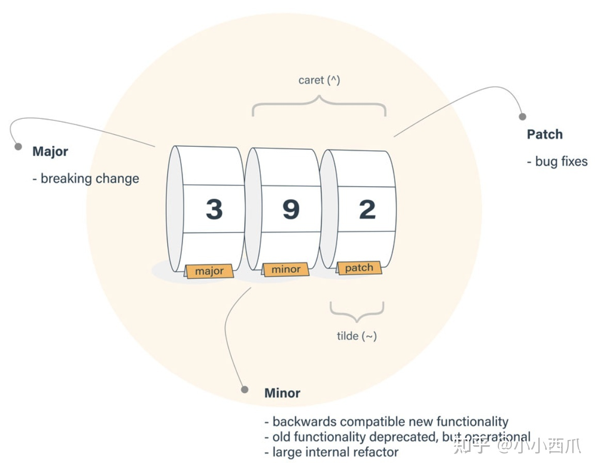

> 相信很多人在最开始使用 npm 安装 NodeJS 的 libraries 时, 搞不太清楚 package.json 中的版本规则, 在这里分享一下

<br>

### 🥑 版本号格式 (semantic versioning)

**{major}**.**{minor}**.**{patch}**-**{pre-release}**<br>
**{主版本号}**.**{次版本号}**.**{修补版本号}**-**{非正式版版本号}**

举个例子:

```json
"dependencies": {
    "typescript": "^4.0.5-0",
}
// 主版本号: 4
// 次版本号: 0
// 修补版本号: 5
// 非正式版版本号: 0
```

### 🥑 dependency 版本更新规则 (dependency version update rule)

| 格式               | 定义                                      | 例子                                   | 用例匹配                                                                         | 备注                                |
| ------------------ | ----------------------------------------- | -------------------------------------- | -------------------------------------------------------------------------------- | ----------------------------------- |
| version            | 完全匹配当前版本                          | 1.0.0                                  | 1.0.0                                                                            |                                     |
| ^version           | 兼容版本<br>(不超过最左边非零数字)        | ^1.2.3 <br> ^0.2.3 <br> ^0.0.3 <br> ^1 | >=1.2.3 <2.0.0-0 <br>>=0.2.3 <0.3.0-0 <br>>=0.0.3 <0.0.4-0 <br> >=1.0.0 <2.0.0-0 | 缺失.minor 或.patch 会默认用 0 代替 |
| ~version           | 最接近匹配版本                            | ~1.2.3 <br> ~1.2 <br> ~1               | >=1.2.3 <1.3.0 <br> >=1.2.0 <1.3.0 <br> >=1.0.0 <2.0.0                           |
| >version           | 大于当前版本                              |                                        |                                                                                  |
| >=version          | 大于等于当前版本                          |                                        |                                                                                  |
| <version           | 小于当前版本                              |                                        |                                                                                  |
| <=version          | 小于等于当前版本                          |                                        |                                                                                  |
| \*                 | 匹配任意版本                              |                                        |                                                                                  |
| latest             | 已发布的最新版本                          |                                        |                                                                                  |
| version1-version2  | version1 到 version2 的任意版本(包括本身) | 1.0.0-2.0.0                            | >=1.0.0 <=2.0.0                                                                  |
| range1 \|\| range2 | 多个范围内的版本                          | < 1.0.0 \|\| >2.0.0                    | <1.0.0 或者 >2.0.0                                                               |
| version.x          | x 的位置表示任意版本                      | 1.2.x                                  | >=1.2.0 <1.3.0                                                                   |

### 🥑 tilde (~) and caret (^)比较

<br>



### 🥑 `npm install`与`npm update`区别

两者最大的区别是在对待已经安装过的模糊版本时候:

- `npm install`会忽略模糊版本

- `npm update`会更新模糊版本至最新

除此之外, install and update 处理 devDependencies 方式也不同

- `npm install`会安装/更新 devDependencies，除非你指定 –production 标志

- `npm update`会忽略 devDependencies，除非你指定 –dev 标志

```json
{
  "name":          "my-project",
  "version":       "1.0",                             // install   update
  "dependencies":  {                                  // ------------------
    "already-installed-versionless-module":  "*",     // ignores   "1.0" -> "1.1"
    "already-installed-semver-module":       "^1.4.3" // ignores   "1.4.3" -> "1.5.2"
    "already-installed-versioned-module":    "3.4.1"  // ignores   ignores
    "not-yet-installed-versionless-module":  "*",     // installs  installs
    "not-yet-installed-semver-module":       "^4.2.1" // installs  installs
    "not-yet-installed-versioned-module":    "2.7.8"  // installs  installs
  }
}
```
